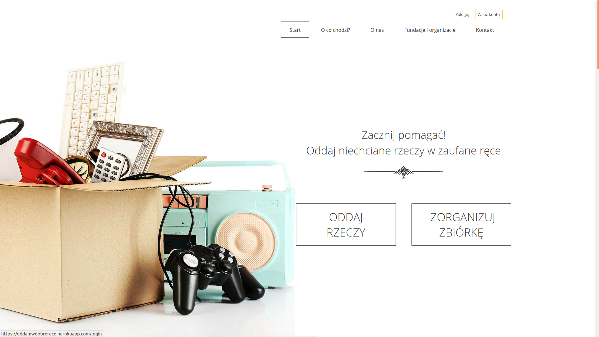
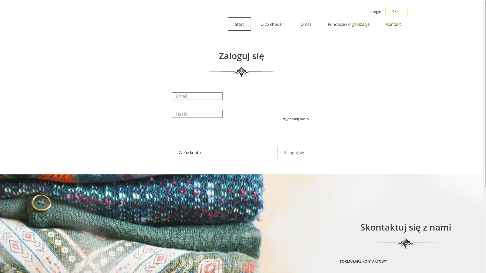
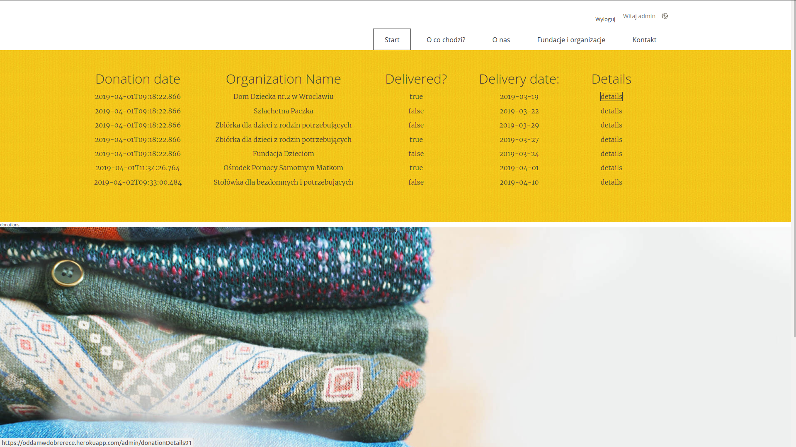
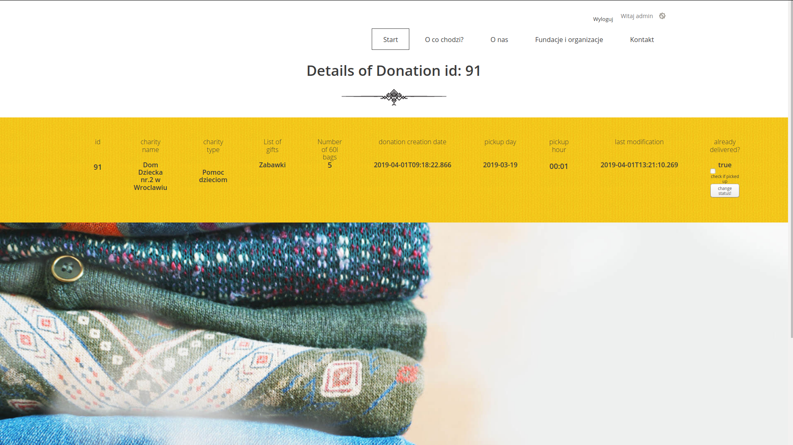

# OddamWDobreRece

A simple application for offering donations to charitable foundations or institutions.
The aim of the project is to create a safe space where everyone can easily donate things (ex. no longer used clothing, toys etc.) to trusted charity institutions. By donating items one can reclaim much needed living space, show others one's environmental awarness and act as a citizen example of decency. Not to mention that it feels good too!

- The user often has things at home that he/she does not need any more. The items are in good condition and he/she wants to pass them on to people to whom they can be of good use - but he/she does not know how to do it in a simple way.
- There are many solutions available, but many of them require additional effort or they do not inspire confidence.
Either you have to go to verified places but you simply have no time to do it or there is no easy way for you to get there and transport everything. While the containers under the house or local collections are readily accessible they are unverified and you cannot be sure if the items you decided to part with would actually reach those in need.
#

Aplikacja do ofiarowywania darowizn na fundacje charytatywne.
Celem projektu jest stworzenie miejsca, w którym każdy będzie mógł oddać niepotrzebne rzeczy zaufanym instytucjom.

- Użytkownik ma w domu rzeczy, których nie używa, ale są  one w dobrym stanie i chce przekazać je osobom, którym się mogą przydać - nie wie jednak jak w prosty sposób to zrobić.
- Jest wiele dostępnych rozwiązań, ale wiele z nich wymaga dodatkowego wysiłku lub nie budzą one zaufania.
W zweryfikowane miejsca trzeba pojechać, a nie ma na to czasu lub nie ma jak tam pojechać. Natomiast kontenery pod domem lub lokalne zbiórki są niezweryfikowane i nie wiadomo czy te rzeczy faktycznie trafią do potrzebujących.

**Note:** Keep the project file structure

You can preview this project [here](https://oddamwdobrerece.herokuapp.com/)

 
 
 
 

